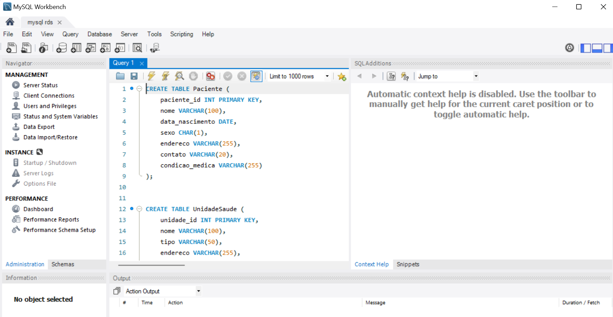

# Banco de dados na RDS

### Modelo lógico


### Criando banco na RDS


### Conectando o banco da no MySQL Workbench


### Criando as tabelas do modelo relacional



### Inserindo dados 


### Confirmando se os dados foram inseridos


### Calculando a média de pacientes transportados por veículos no mês 


### Querys Utilizada 
```
CREATE TABLE Paciente (
    paciente_id INT PRIMARY KEY,
    nome VARCHAR(100),
    data_nascimento DATE,
    sexo CHAR(1),
    endereco VARCHAR(255),
    contato VARCHAR(20),
    condicao_medica VARCHAR(255)
);

CREATE TABLE PacienteUnidade (
    paciente_id INT,
    unidade_id INT,
    PRIMARY KEY (paciente_id, unidade_id), 
    FOREIGN KEY (paciente_id) REFERENCES Paciente(paciente_id),
    FOREIGN KEY (unidade_id) REFERENCES UnidadeSaude(unidade_id)
);

CREATE TABLE UnidadeSaude (
    unidade_id INT PRIMARY KEY,
    nome VARCHAR(100),
    tipo VARCHAR(50),
    endereco VARCHAR(255),
    contato VARCHAR(20)
);

CREATE TABLE VeiculoMedico (
    veiculo_id INT PRIMARY KEY,
    tipo VARCHAR(50),
    capacidade INT,
    placa VARCHAR(20),
    estado VARCHAR(20)
);

CREATE TABLE ProdutoMedico (
    produto_id INT PRIMARY KEY,
    nome VARCHAR(100),
    tipo VARCHAR(50),
    quantidade_estoque INT,
    data_validade DATE
);

CREATE TABLE RotaTransporte (
    rota_id INT PRIMARY KEY,
    origem VARCHAR(255),
    destino VARCHAR(255),
    distancia FLOAT,
    tempo_estimado TIME
);

CREATE TABLE TransportePaciente (
    transporte_id INT PRIMARY KEY,
    paciente_id INT,
    veiculo_id INT,
    data_hora DATETIME,
    origem VARCHAR(255),
    destino VARCHAR(255),
    rota_id INT,
    condicao_paciente VARCHAR(255),
    FOREIGN KEY (paciente_id) REFERENCES Paciente(paciente_id),
    FOREIGN KEY (veiculo_id) REFERENCES VeiculoMedico(veiculo_id),
    FOREIGN KEY (rota_id) REFERENCES RotaTransporte(rota_id)
);

CREATE TABLE AvaliacaoEficiencia (
    avaliacao_id INT PRIMARY KEY,
    data_avaliacao DATE,
    metricas_avaliadas VARCHAR(255),
    acoes_corretivas_propostas VARCHAR(255)
);

CREATE TABLE EntregaProduto (
    entrega_id INT PRIMARY KEY,
    produto_id INT,
    veiculo_id INT,
    data_hora DATETIME,
    destino VARCHAR(255),
    quantidade_entregue INT,
    avaliacao_id INT,
    FOREIGN KEY (produto_id) REFERENCES ProdutoMedico(produto_id),
    FOREIGN KEY (veiculo_id) REFERENCES VeiculoMedico(veiculo_id),
    FOREIGN KEY (avaliacao_id) REFERENCES AvaliacaoEficiencia(avaliacao_id)
);

```
```
INSERT INTO Paciente (paciente_id, nome, data_nascimento, sexo, endereco, contato, condicao_medica) VALUES
(1, 'João Silva', '1990-05-15', 'M', 'Rua A, 123', '(11) 98765-4321', 'Diabetes tipo 2'),
(2, 'Maria Santos', '1985-08-20', 'F', 'Rua B, 456', '(11) 98765-1234', 'Pressão alta'),
(3, 'Carlos Oliveira', '1978-02-10', 'M', 'Rua C, 789', '(11) 98765-5678', 'Asma');


INSERT INTO UnidadeSaude (unidade_id, nome, tipo, endereco, contato) VALUES
(1, 'Hospital Central', 'Hospital', 'Av. Principal, 1000', '(11) 1234-5678'),
(2, 'Clinica ABC', 'Clínica', 'Av. Secundária, 2000', '(11) 2345-6789'),
(3, 'Posto de Saúde XYZ', 'Posto de Saúde', 'Av. Alternativa, 3000', '(11) 3456-7890');

INSERT INTO VeiculoMedico (veiculo_id, tipo, capacidade, placa, estado) VALUES
(1, 'Ambulância', 4, 'ABC-1234', 'Disponível'),
(2, 'Veículo de Entrega', 1000, 'XYZ-5678', 'Disponível');

INSERT INTO ProdutoMedico (produto_id, nome, tipo, quantidade_estoque, data_validade) VALUES
(1, 'Aspirina', 'Medicamento', 500, '2024-12-31'),
(2, 'Desfibrilador', 'Equipamento Médico', 10, '2025-06-30'),
(3, 'Luvas Cirúrgicas', 'Suprimento Hospitalar', 2000, '2024-09-30');

INSERT INTO TransportePaciente (transporte_id, paciente_id, veiculo_id, data_hora, origem, destino, condicao_paciente) VALUES
(1, 1, 1, '2024-05-04 08:00:00', 'Hospital Central', 'Clínica ABC', 'Estável'),
(2, 2, 1, '2024-05-04 10:30:00', 'Casa do paciente', 'Hospital Central', 'Grave'),
(3, 3, 1, '2024-05-04 12:45:00', 'Posto de Saúde XYZ', 'Hospital Central', 'Estável');


INSERT INTO EntregaProduto (entrega_id, produto_id, veiculo_id, data_hora, destino, quantidade_entregue) VALUES
(1, 1, 2, '2024-05-04 09:00:00', 'Hospital Central', 100),
(2, 2, 2, '2024-05-04 11:00:00', 'Hospital Central', 2),
(3, 3, 2, '2024-05-04 13:00:00', 'Hospital Central', 1000);


INSERT INTO RotaTransporte (rota_id, origem, destino, distancia, tempo_estimado) VALUES
(1, 'Hospital Central', 'Clínica ABC', 10.5, '00:15:00'),
(2, 'Casa do paciente', 'Hospital Central', 8.2, '00:20:00'),
(3, 'Posto de Saúde XYZ', 'Hospital Central', 15.0, '00:30:00');

INSERT INTO AvaliacaoEficiencia (avaliacao_id, data_avaliacao, metricas_avaliadas, acoes_corretivas_propostas) VALUES
(1, '2024-05-01', 'Tempo médio de transporte de pacientes', 'Revisar rotas para reduzir tempo de viagem'),
(2, '2024-05-01', 'Nível de estoque de produtos médicos', 'Reabastecer produtos com baixo estoque'),
(3, '2024-05-01', 'Disponibilidade de veículos médicos', 'Realocar veículos conforme demanda');

```


```
SELECT 
    TransportesPorVeiculoPorMes.mes,
    AVG(TransportesPorVeiculoPorMes.total_transportes * 1.0 / TotalVeiculosPorMes.total_veiculos) AS media_pacientes_transportados
FROM (
    SELECT 
        MONTH(data_hora) AS mes,
        COUNT(DISTINCT veiculo_id) AS total_veiculos
    FROM TransportePaciente
    GROUP BY MONTH(data_hora)
) AS TotalVeiculosPorMes
JOIN (
    SELECT 
        MONTH(data_hora) AS mes,
        veiculo_id,
        COUNT(*) AS total_transportes
    FROM TransportePaciente
    GROUP BY MONTH(data_hora), veiculo_id
) AS TransportesPorVeiculoPorMes ON TotalVeiculosPorMes.mes = TransportesPorVeiculoPorMes.mes
GROUP BY TransportesPorVeiculoPorMes.mes;
```